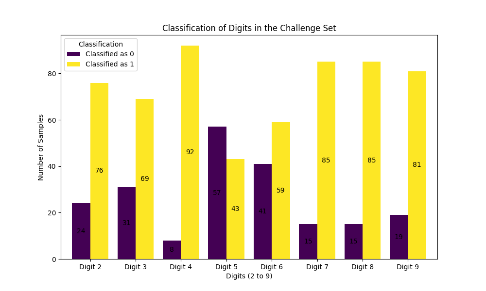
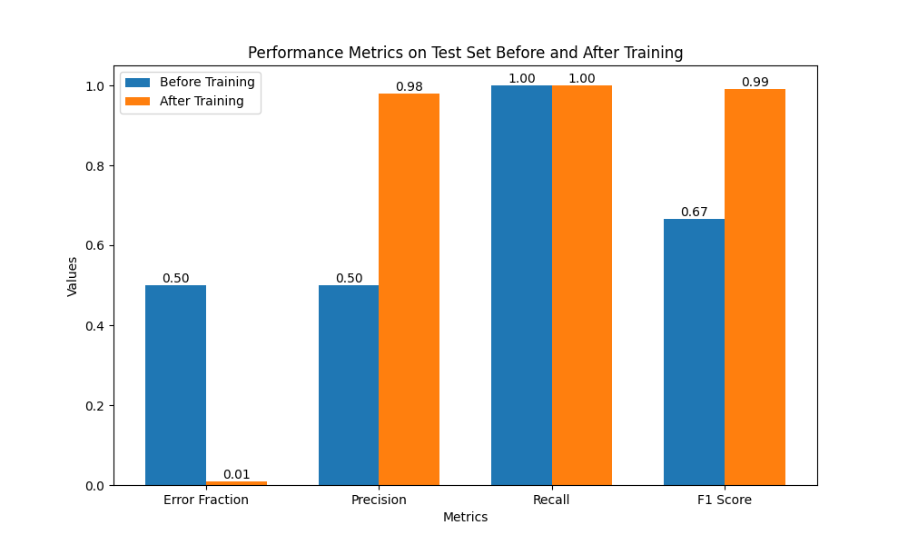
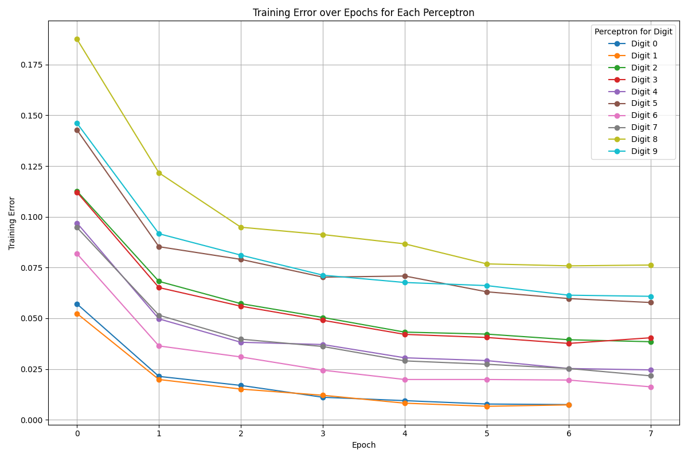
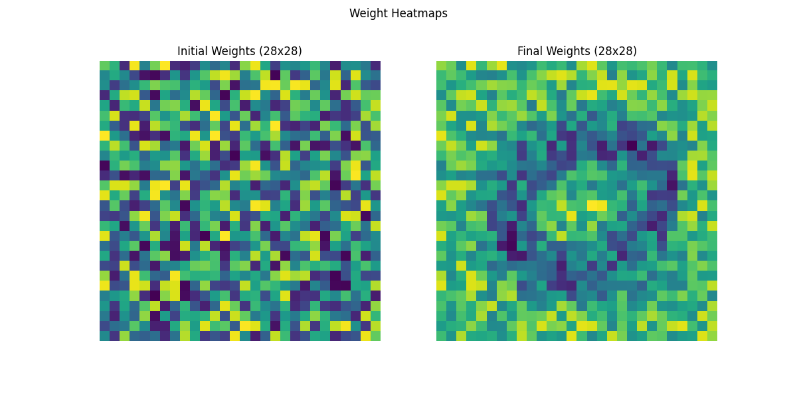

# Neuro Eval Lab

This project was developed as part of the **Intelligent Systems** class taught by **Professor Ali A. Minai** at the **University of Cincinnati, Department of Electrical and Computer Engineering and Computer Science**. 

This project implements a single-layer perceptron model for binary classification of handwritten digits from the MNIST dataset. The perceptron model is used to distinguish between binary outcomes, focusing on optimizing performance metrics such as error fraction, precision, recall, and F1 score.


## Repository Structure

- `data/` - Contains all training, testing, and challenge datasets.
- `figures/` - Contains figures illustrating performance metrics and training progress.
- `methods/` - Contains helper functions for data preprocessing and evaluation metrics.
- `models/` - Contains the `Perceptron` model.
- `main.py` - Main script to run the training, evaluation, and plotting functions.
- `requirements.txt` - List of dependencies to install for running the code.

## Installation

1. Clone the repository:
    ```bash
    git clone https://github.com/AdonaiVera/neuro-eval-lab.git
    cd neuro-eval-lab
    ```

2. Install required packages:
    ```bash
    pip install -r requirements.txt
    ```

## Running the Code

To train the perceptron models, evaluate them, and generate plots, run the following command:

```bash
python main.py
```

This command will execute the training process and display metrics for each digit classification perceptron.

## Results and Figures

The following figures illustrate the performance and results achieved through the perceptron model:

1. **Classification of Digits in the Challenge Set**

   
   
   This figure shows the distribution of samples classified as 0 or 1 for each digit in the challenge set.

2. **Performance Metrics Before and After Training**

   
   
   This figure compares the error fraction, precision, recall, and F1 score on the test set before and after training.

3. **Training Error over Epochs for Each Perceptron**

   
   
   This figure illustrates the error reduction over epochs, indicating the learning progress for each digit-specific perceptron.

4. **Initial and Final Weight Heatmaps**

   
   
   The weight heatmaps show the perceptron’s weights before and after training, visualizing how they adapt through the learning process.

## License

This project is licensed under the MIT License.
